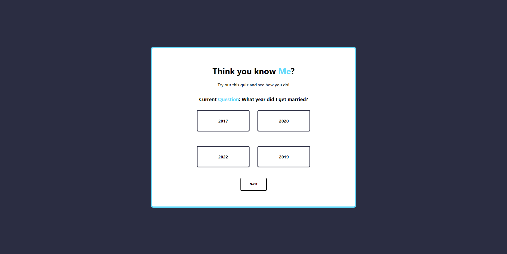

#KnowMe
A simple quiz to learn more about me! The guy behind the code. 

**Link to project:** https://knowme.onrender.com/

## How It's Made:

**Tech used:** React, PostgreSQL, Flask, Python

I recently learned Python and wanted to learn how integrate it into a project. So I made a quiz!

The application is connected to a postgres database on bit.io.
The application when loaded connects to the database and retrieves information from the questions table, which has the format { title, option1, option2, option3, answer} I have saved on it.
There are 10 questions altogether (I may or may not add more in the future just for fun) which can be shown, but only 5 returned randomly from SQL statement.

Once the questions are fetched from the frontend I was able to shuffle the order in which they appear into an array, and from there I was able to display them into their own divs. The shuffling was to prevent the correct answer from appearing in the same box out of the 4 divs over and over again.

The interesting part was learning how to let a user know when they got the right answer or not, which was just passing the id of the element and answer to a custom function and checking if it is a match. If it was I would add the correct class to the element that changes the background color of the elements div to green, and if it was wrong changing it to red.

When the user clicks on the next button, I made it so a variable (current) keeps track of what question we are on, every time current is changed, the application grabs the next question, and once again shuffles the details and displays it. This goes until there are no more questions to show.

I was able to keep track of the score a user would have by updating the score variable with use state every time the user guessed the right answer and lastly returning a string at the end of the quiz which varies by how well...or how poor they did.

## Lessons Learned:
• When deploying with both Python and React you want to make sure when building you have commands to install all packages for both python(backend), and your frontend packages.
• I learned to connect to a remote database on a different platform all together and was able to connect to it using an API key. 

